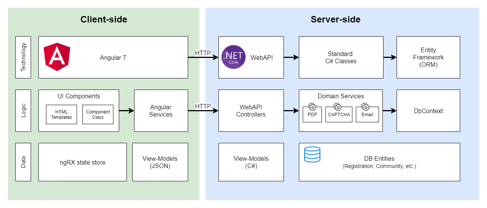

# EMBC ESS

Emergency Management BC - Emergency Support Services Modernization


Technology Stack
-----------------

| Layer   | Technology |
| ------- | ------------ |
| Presentation | Angular 7 |
| API and Business Logic | C# - Dotnet Core 2.1 |
| Web Server | Kestrel |
| Data | SQL Server 2017 |
| Runtime | OpenShift containers |

Knowledgebase
-----------------------
Throughout the project there are readme documents. Those specific documents can be browsed from the [knowledgebase.](documentation/index.md)

Installation
------------
This application is meant to be deployed to RedHat OpenShift version 3. Full instructions to deploy to OpenShift are in the `openshift` directory.

Developer Prerequisites
-----------------------

**Public Application**

- .Net Core 2.1 SDK
- Node.js version 8 LTS
- Angular 7 
- .NET Core IDE such as Visual Studio or VS Code
- Local instance of SQL Server

**DevOps**

- RedHat OpenShift tools
- Docker
- A familiarity with Jenkins

## Project Architecture



## Files in this repository

```
project
+-- .s2i
|   +-- bin                     (Source to image (s2i) scripts for OpenShift)
+-- embc-app
|  +-- embc-app.sln             (solution file for Visual Studio 2017+)
|  +-- embc-app.csproj          (main application project)
+-- embc-interfaces
|  +-- BCeID 
|     +-- BCeID.csproj          (proxy to consume BCeID web services)
+-- embc-unit-tests
|  +-- embc-unit-tests.csproj
+-- openshift
|  +-- other-templates
|  |  +-- sql-server             (sql server templates)
|  +-- templates
|  |  +-- embcess                (main app templates)
|  |  +-- pdf-service            (pdf rendering service templates)
+-- pdf-service                  (pdf rendering service code)
+-- sql-scripts                  (scripts for backend ops on the data)
+-- sql-server                   (SQL Server docker scripts) 
```

Backend Unit Tests
-----------------------
Run ```dotnet test``` from embc-app folder

Backend local machine debugging
-------------------------------
Set the following environment variables:
```
SET ASPNETCORE_Environment=Development
//WIP: SET BASE_URL=/embcess
```

Execute ```dotnet run``` from embc-app folder

Environment Variables
---------------------

Before running the API locally, you must set some environment variables:

| Name | Value |
| ---- | ----- |
| BASE_PATH |/embcess|
| BASE_URI |http://localhost|
| APP_ENVIRONMENT_TITLE     |   Banner title (shown on all environments except PROD).   |
| DATABASE_SERVICE_NAME     |   Database service URL                                    |
| DB_DATABASE               |   <database_name>                                         |
| DB_ADMIN_PASSWORD         |   SA (admin) password                                     |
| DB_USER                   |   DB connection credentials                               |
| DB_PASSWORD               |   DB connection credentials                               |
| SMTP_HOST                 |   smtp.youremailserver.com                                |
| SMTP_DEFAULT_SENDER       |   no-reply@youremailserver.com                            |
| PDF_SERVICE_NAME          |   PDF microservice URL                                    |
|AUTH_MODE                  |   KC for KeyCloak  or SM for SiteMinder                   |
|auth:oidc:MetaDataAddress  |   KeyCloak client meta data URL                           | 
|auth:oidc:ClientId         |   KeyCloak client ID                                      |
|auth:oidc:ClientSecret     |   KeyCloak client secert                                  |

DevOps Process
-------------

### Jenkins

If any pipeline steps do not start, a common root cause is issues with Jenkins.  Restart the Jenkins service by scaling it down to 0 pods, then back up to 1 pod.

### DEV builds
Dev builds are triggered by source code being committed to the repository.  This process triggers a webhook which initiates the DEV build pipeline.

## Promotion to TEST
Login to the OpenShift Web Console and navigate to the Tools project for the system.  Go to Builds->Pipelines.  Click  Start Pipeline on the Test Pipeline.

## Promotion to PROD
Login to the OpenShift Web Console and navigate to the Tools project for the system.  Go to Builds->Pipelines.  Click  Start Pipeline on the Prod Pipeline.


Authentication
--------------

### BCeID

Business BCeID may be used to login as a Volunteer.

### IDIR

Government users may use IDIR to login as an Administrator.

### Development Users

Access /login/token/username to login as a test BCeID user for development purposes.

### Environments

| Environment | URL                                    | VPN Required? |
| ----------- | -------------------------------------- | ------------- |
| DEV         | https://dev.justice.gov.bc.ca/embcess  | Yes           |
| TEST        | https://test.justice.gov.bc.ca/embcess | Yes           |
| PROD        | https://justice.gov.bc.ca/embcess      | No            |


Contribution
------------

Please report any [issues](https://github.com/bcgov/embc-ess/issues).

[Pull requests](https://github.com/bcgov/embc-ess/pulls) are always welcome.

If you would like to contribute, please see our [contributing](CONTRIBUTING.md) guidelines.

Please note that this project is released with a [Contributor Code of Conduct](CODE_OF_CONDUCT.md). By participating in this project you agree to abide by its terms.

License
-------

    Copyright 2019 Province of British Columbia
    
    Licensed under the Apache License, Version 2.0 (the "License");
    you may not use this file except in compliance with the License.
    You may obtain a copy of the License at 
    
       http://www.apache.org/licenses/LICENSE-2.0
    
    Unless required by applicable law or agreed to in writing, software
    distributed under the License is distributed on an "AS IS" BASIS,
    WITHOUT WARRANTIES OR CONDITIONS OF ANY KIND, either express or implied.
    See the License for the specific language governing permissions and
    limitations under the License.

Maintenance
-----------

This repository is maintained by [BC Attorney General]( https://www2.gov.bc.ca/gov/content/governments/organizational-structure/ministries-organizations/ministries/justice-attorney-general ).
