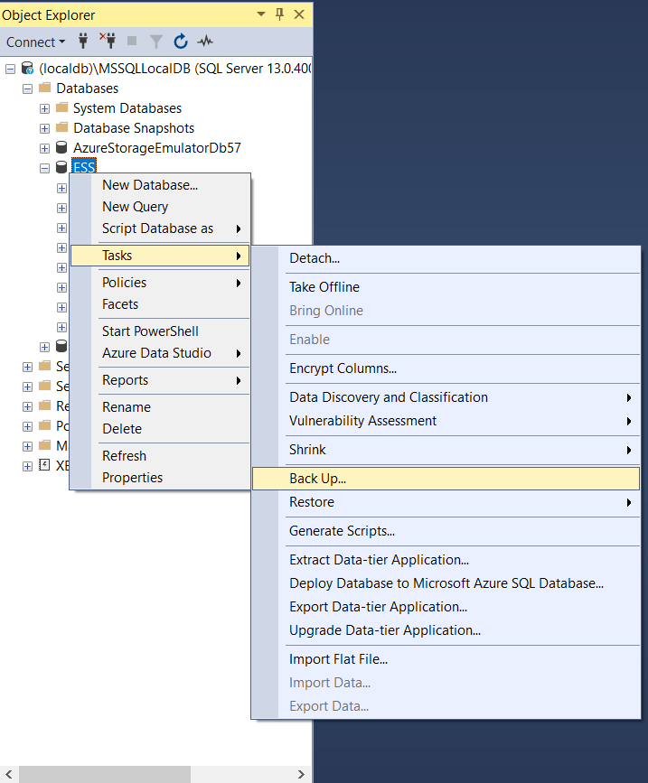
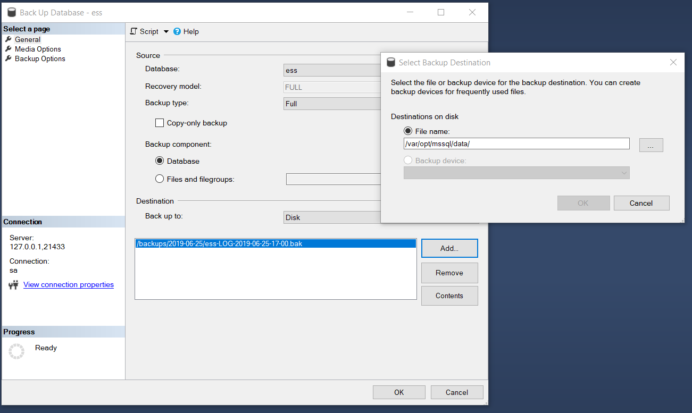
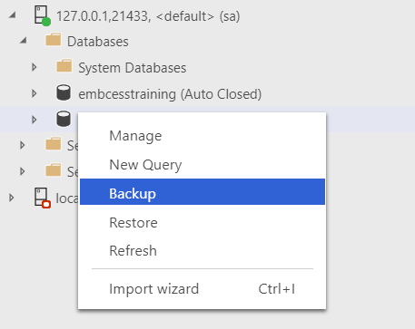
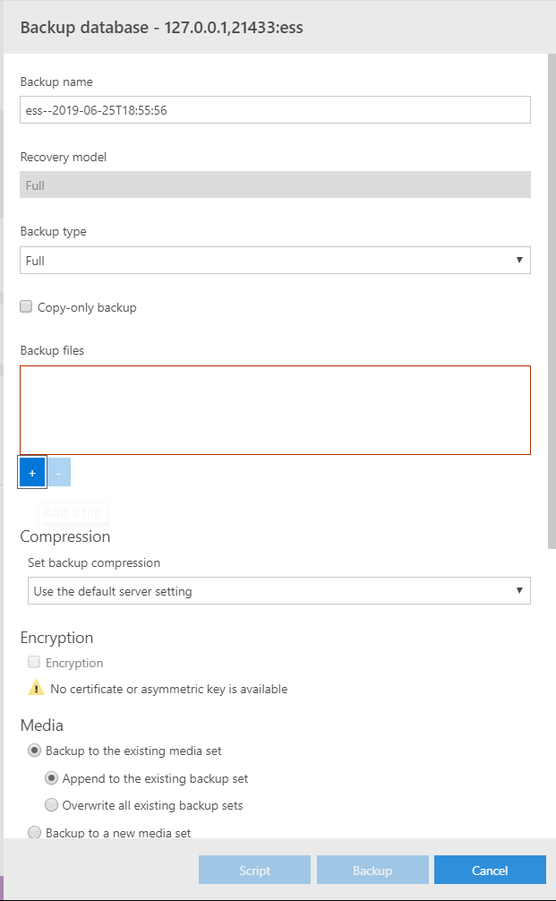
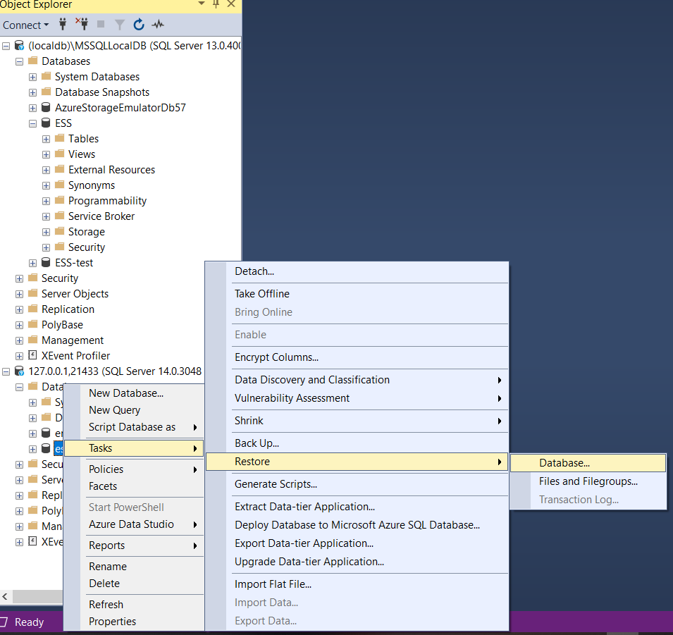
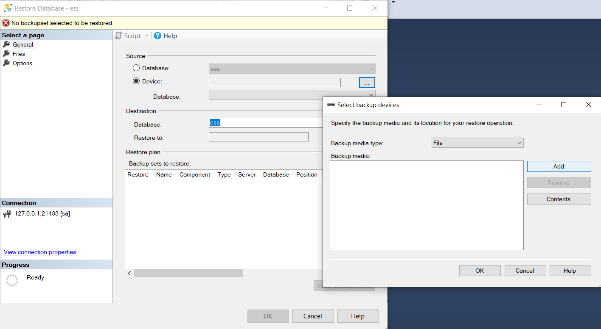
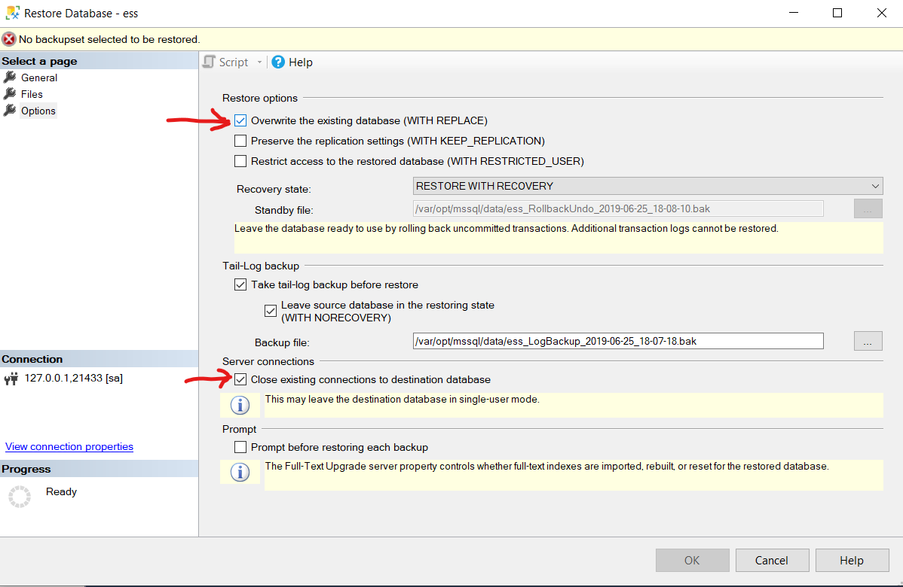
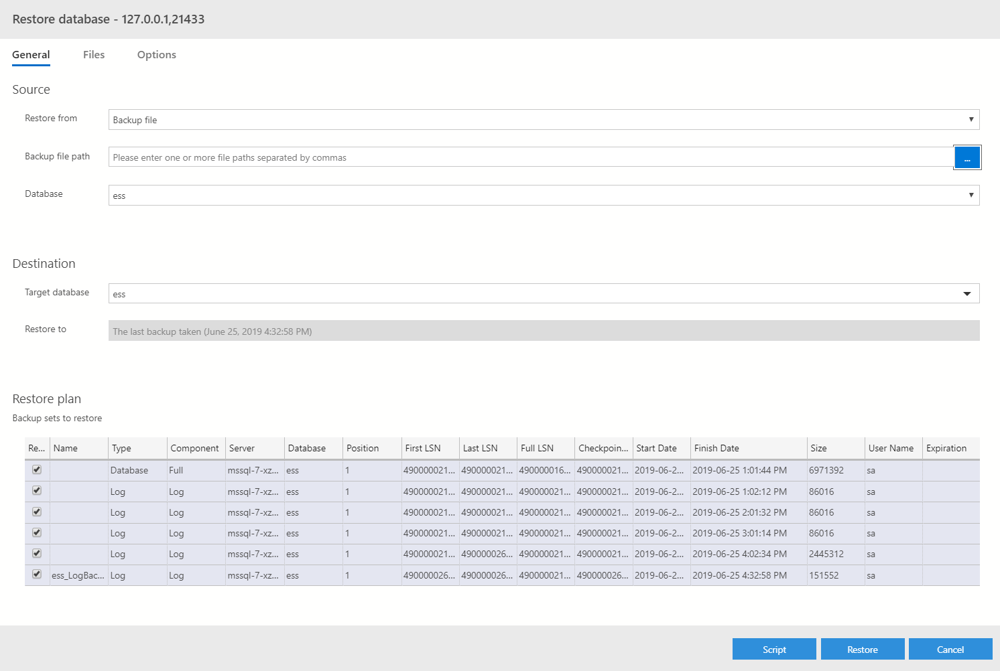
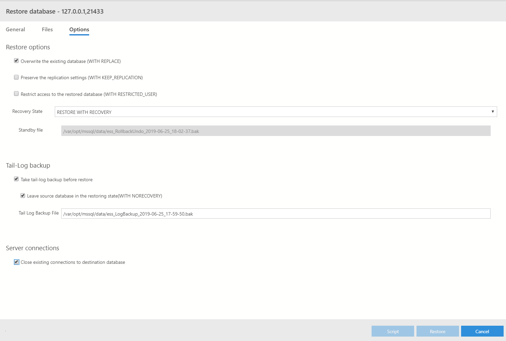

# Performing Manual Database Backups and Restores

## Backup Database
1. Connect to Database Pod
2. Open Data management tool to the table such as Sql Server Management Studio (SSMS) or Azure Data Studio (ADS)
3. On SSMS   ```Right-Click on Database and select **Tasks** -> **Backup Database** 
     
    ```Ensure **Database** is selected as a <u>Backup component:</u>
    ```Select <u>Destination</u> as a <u>Back up to:</u> **Disk** and click **Add**
     
    ```In the popup, enter the <i>file name</i>, then click **Ok**```Then click **Ok** on the main <i>Backup Up Database</i> window
    <br />   
    On ADS
    ```Right-Click on Database and select **Backup**
     
    ```Enter a <i>Backup Name</i>
    ```Remove the current backup file by selecting and clicking "-", then click "+" to enter a new specific backup file
    ```Click **Backup** button
     

## Restore Database
1. Connect to Database Pod
2. Open Data management tool to the table such as Sql Server Management Server (SSMS) or Azure Data Studio (ADS)
3. On SSMS
    ```Right click on Database and select **Tasks** -> **Restore** -> **Database**
     
    ```On the **General** page select **Device**, then click '...' button
    ```Click the **Add** button and enter a file name
     
    ```Next click the **Options** Page
    ```Ensure that **Overwrite the existing database** is selected <u>Restore Options</u>
    ```As well, under <u>Server Connections</u>, select **Close existing connections to the database**
    ```Click **Ok** and then **Ok** on the the main restore window
     

   On ADS
        ```Right-Click on Database and select **Restore**
         
        ```Ensure <i>Backup file</i> is selected under **Source**
        ```Click the "..." button to select the backup file
        ```Next click the **Options** Page
        ```Ensure that **Overwrite the existing database** is selected under <u>Restore Options</u>
        ```As well, under <u>Server Connections</u>, select **Close existing connections to the database**
        ```Click the **Restore** button
         
